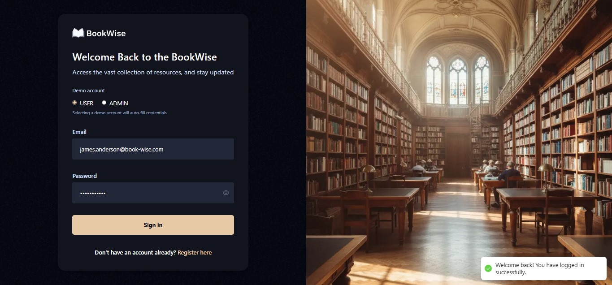
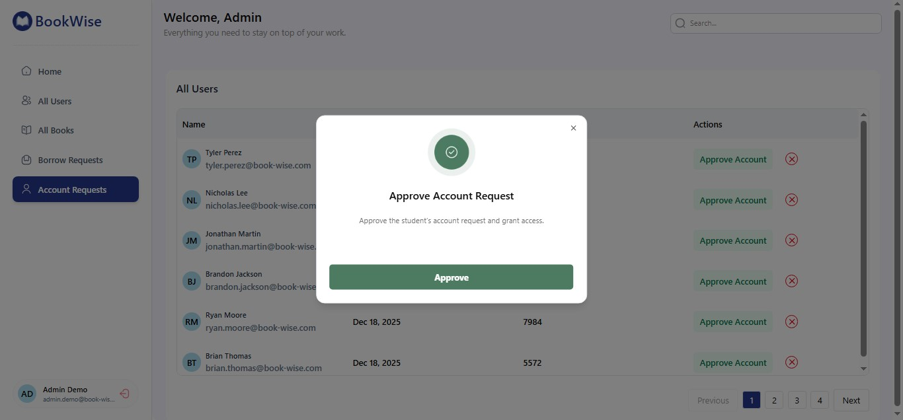
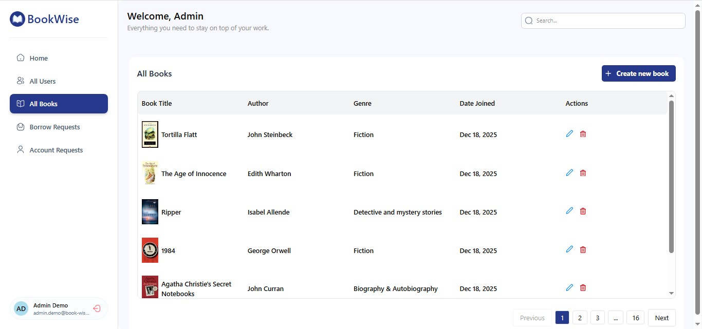
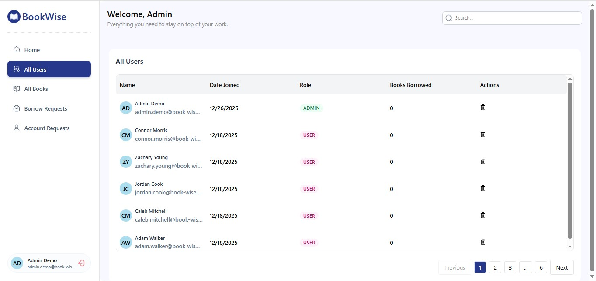

# 📚 Library Management System

## Description

A **Library Management System** built with **Next.js** and **Supabase** to manage books, users, and borrowing operations with **role-based access control**.

This project is designed as a real-world SaaS-style application, focusing on clean architecture, secure data access using Supabase RLS, and modern React patterns.

---

## 🚀 Tech Stack

- **Next.js** (App Router)
- **TypeScript**
- **Supabase** (Authentication, Database, Row Level Security)
- **React Hook Form**
- **Yup** (schema validation)
- **TanStack Query**
- **TanStack Table**
- **shadcn/ui**
- **Tailwind CSS**

---

## ✨ Features

- Authentication (Sign In / Sign Up)
- Account approval system (users cannot access the app until approved by admin)
- Role-based access control (**ADMIN / USER**)
- Books management (add / edit / delete)
  - Prevent deleting a book if it is currently borrowed

- Borrowing system
  - Users can borrow books
  - Admin can update borrow status

- User management
  - Admin can delete users
  - Prevent deleting users with active borrow records

- Secure data access using **Supabase RLS policies**
- Protected routes

---

## 👥 Roles & Permissions

### **ADMIN**

- Manage books (add, edit, delete)
- Manage borrowing operations
- Manage users (delete users)

### **USER**

- View available books
- Borrow books

---

## ⚙️ Setup Instructions

### 1. Install dependencies

```bash
npm install
```

### 2. Environment variables

Create a `.env.local` file in the root of the project and add the following variables:

```env
NEXT_PUBLIC_SUPABASE_URL=
NEXT_PUBLIC_SUPABASE_ANON_KEY=
```

> ⚠️ Do not commit your environment variables to version control.

### 3. Run the development server

```bash
npm run dev
```

The application will be available at `http://localhost:3000`.

---

## 🛡️ Security

- Authentication handled by Supabase Auth
- Authorization enforced using **Row Level Security (RLS)**

---

## 📌 Notes

- The project uses modern React patterns and server/client component separation
- Designed to be scalable and production-ready

---

## 📷 Screenshots

### Sign In



### Account Approval



### Admin – Books Management



### Admin – Users Management



### User – Borrow Book


---

## 📄 License

This project is for learning and portfolio purposes.
